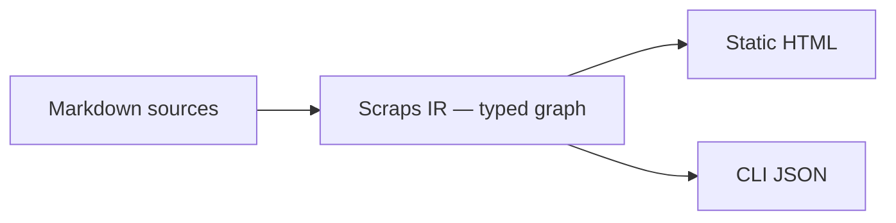

<h1 align="center">
  <br>
  
  <br>
  Scraps
  <br>
</h1>

<p align="center">
<strong>The Wiki-link doc compiler for the LLM era.</strong>
</p>

<p align="center">
<a href="https://boykush.github.io/scraps/"></a>
<a href="https://crates.io/crates/scraps"></a>
<a href="https://github.com/boykush/scraps/blob/main/LICENSE.md"></a>
<a href="https://github.com/boykush/scraps/actions/workflows/cargo-test-and-lint.yml"></a>
</p>

Scraps treats documentation like a programming language. Wiki-linked markdown becomes a typed source, compiling into a static site for readers and into JSON any agent can shell into — turning Karpathy's *LLM Wiki* pattern into a typed, queryable artifact. CLI primary with companion AI skills, fitting any editor and any LLM agent.

## Quick start

```bash
# Install
brew install boykush/tap/scraps    # or: cargo install scraps

# Compile a wiki
mkdir my-wiki && cd my-wiki
scraps init
scraps build

# Query the same source from a shell or AI agent
scraps search "release checklist" --json
scraps links "Configuration" --json
scraps lint
```

See the [Getting Started tutorial](https://boykush.github.io/scraps/scraps/tutorial/getting-started.html) for the full flow.

## How it works



Scraps reads `[[wiki-link]]`, `#[[tag]]`, `![[embed]]`, `[[Page#heading]]`, and `ctx_path` as typed primitives. The same source compiles to an HTML site for human readers and to JSON for scripts and AI agents.

## AI integration

CLI + JSON is the primary path — any shell-capable agent can query Scraps without an MCP client implementation. Bundled plugins provide agent-facing workflows:

- [`scraps`](plugins/scraps) — Karpathy-style *Ingest / Query / Lint* skills for Claude Code and Codex, plus a Claude Code `lint-rule-handler` agent
- [`mcp-server`](plugins/mcp-server) — MCP server for MCP-compatible clients

See the [AI integration guide](https://boykush.github.io/scraps/scraps/how-to/integrate-with-ai-assistants.html) for the trade-offs.

## Documentation

- [Documentation site](https://boykush.github.io/scraps/) — Tutorial, How-to, Reference, Explanation
- [Sample wiki](https://boykush.github.io/wiki/) — Japanese knowledge base built with Scraps

## Screenshots


*Search, pagination, and Wiki-link navigation, themed with [Nord](https://www.nordtheme.com/).*

<details>
<summary>Light mode</summary>

</details>

## Contributing

Bugs, feature requests, and PRs are welcome. See [CONTRIBUTING.md](CONTRIBUTING.md), the [issue templates](https://github.com/boykush/scraps/issues/new/choose), and the [Code of Conduct](CODE_OF_CONDUCT.md).

## License

MIT
