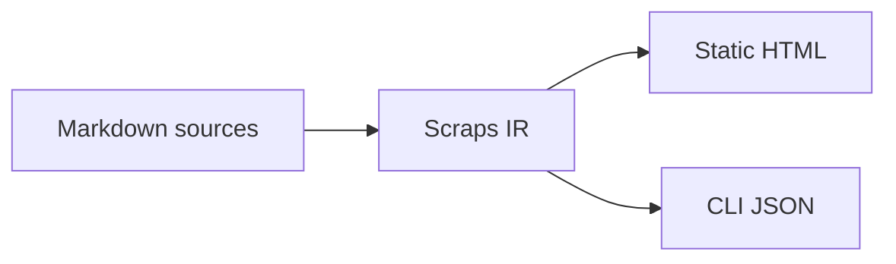

#[[Notation/Wiki-link]] #[[Emit/Static Site]] #[[Emit/CLI JSON]]


Scraps is a wiki-link document compiler for the LLM era.

It turns human-curated Markdown into a typed, queryable knowledge artifact.
The same source can become a static site for readers and structured JSON for
scripts or AI agents.

## Markdown as typed source

Scraps keeps authoring close to plain Markdown, but gives a few pieces of
syntax clear meaning:

- `[[link]]` references another scrap
- `#[[tag]]` marks a tag
- `[[name#heading]]` references a heading inside another scrap
- `![[embed]]` embeds content from another scrap
- folders provide context, so `DDD/Service.md` and `Kubernetes/Service.md` are
  different scraps

Because these are typed, Scraps can lint broken references, render navigation,
and expose structured documentation data to other tools. See
[[Reference/Wiki-link Notation]] for the full syntax and resolution rules,
and [[Reference/CLI Overview#lint]] for the lint surface that enforces them.

## More than a static site generator

Scraps reads Markdown into structured knowledge data, then emits useful
outputs from it:



Scraps focuses on two outputs:

- **[[Reference/Static Site|Static HTML]]** for human readers
- **[[Reference/CLI Overview#--json|CLI JSON]]** for scripts, CI, and AI agents

The static site is one important output, but the core artifact is structured
documentation data that preserves links, tags, headings, tasks, and context.

## CLI-first for agents

Any assistant that can run shell commands can query Scraps directly:

```bash
❯ scraps search "release checklist" --json
❯ scraps get "Configuration" --json
❯ scraps backlinks "Configuration" --json
❯ scraps todo --status all --json
```

Shell plus JSON is the primary agent integration path. Scraps also provides
an MCP server for MCP-compatible clients — see
[[How-to/Integrate with AI Assistants]] for both paths and the trade-offs
between them.

## Influenced by LLM Wiki

Scraps is influenced by Andrej Karpathy's *LLM Wiki* idea: a persistent,
curated knowledge base that compounds over time and gives AI agents something
better than one-off context stuffing.

<https://gist.github.com/karpathy/442a6bf555914893e9891c11519de94f>

Scraps keeps that spirit, but makes cross-references explicit. Instead of
relying on implicit mentions, Scraps uses `[[link]]`, `#[[tag]]`, and
lintable structure so the same wiki can serve both human readers and machine
queries.

## Local-first

The directory containing `.scraps.toml` is the wiki root. Markdown files
under that root are scraps, and folders become bounded context. See
[[Reference/Configuration#project-root]] for multi-wiki layouts.

Scraps fits into normal Git workflows: write Markdown, review changes in pull
requests, run `scraps lint` for wiki health, and build or query the same
source whenever you need it.
