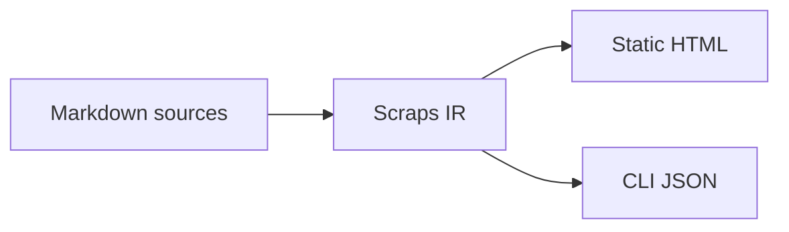

#[[Notation/Markdown]]

Scraps compiles standard Markdown plus [[Reference/Wiki-link Notation]].
Authoring stays
close to plain Markdown so files render correctly in any viewer, and the
typed `[[…]]` overlay adds compiler-enforced cross-references on top.

## CommonMark

Headings, paragraphs, lists, code blocks, links, and emphasis follow the
CommonMark specification.

<https://spec.commonmark.org/>

## GitHub-flavored Markdown

GFM extensions are supported: tables, task lists, strikethrough, autolinks.

<https://github.github.com/gfm/>

```markdown
| Column | Column |
|---|---|
| cell | cell |

- [x] done
- [ ] open
- [-] deferred

~~strikethrough~~
```

GFM task list items are aggregated wiki-wide by [[Reference/CLI Overview#todo]].

## Mermaid

Code blocks tagged `mermaid` render as Mermaid diagrams.

````markdown

````

<https://mermaid.js.org/intro/>

## Autolink with OGP card

Bare URLs wrapped in angle brackets render as OGP cards on the static site,
fetching the target page's Open Graph metadata at build time.

```markdown
<https://github.com/boykush/scraps>
```

Use autolinks deliberately: the card is heavy compared to an inline link.
Reach for `<…>` when the link is a "you should look at this" pointer
(canonical source, prior art, recipe target). Use `[text](url)` for inline
references that the reader skims past.

The wiki root `README.md` is one exception — autolinks there fall back to
plain links because the index page does not render OGP cards. See
[[Reference/Static Site#README and the index page]].
