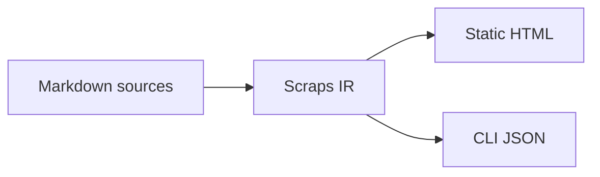

#[[Notation/Markdown]]

Code blocks tagged `mermaid` render as Mermaid diagrams. This site uses
one to show the [[Reference/Static Site/Pipeline|compile pipeline]].

````markdown

````

<https://mermaid.js.org/intro/>
