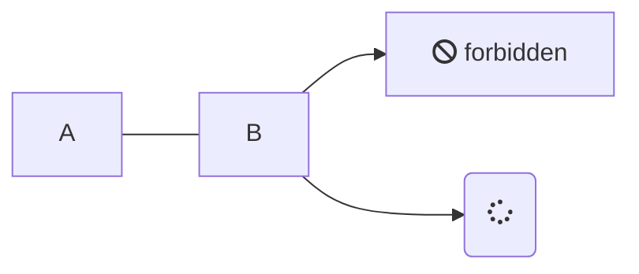

#[[Markdown]]

By specifying `mermaid` as the language for a code block, you can use [Mermaid](https://mermaid.js.org/intro/) diagrams.

## Example

---

### In

<pre><code>

</code></pre>

### Out

