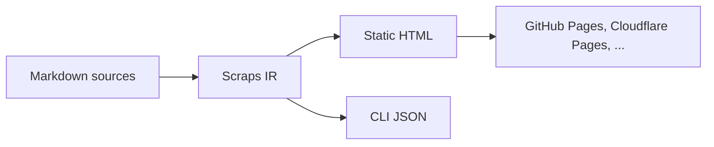

#[[Emit/Static Site]]

The static site is one of the emit targets Scraps compiles to. The other
first-class target is JSON from [[Reference/CLI Overview]]. See
[[Explanation/What is Scraps?#more-than-a-static-site-generator]] for why
Scraps decenters SSG from its narrative while keeping the HTML output
fully supported.

The full SSG schema lives in [[Reference/Configuration]] (`[ssg]` and root
level); the same block is embedded at the bottom of this page for in-place
reading.

## Pipeline



The HTML emitter takes the Scraps IR and produces a static directory tree,
which any Pages-class host can serve. See [[How-to/Deploy to GitHub Pages]]
for one such recipe.

## Output structure

Build output is written to the directory configured by `output_dir` (default
`_site/`).

```bash
❯ tree _site
_site
├── index.html              # README.md or scrap index
├── scraps/
│   ├── getting-started.html
│   └── guide/
│       └── links.html
├── main.css                # Site styling
└── search_index.json       # Search index (when build_search_index = true)
```

Each Markdown file is converted to a slugified HTML file under `scraps/`.
Folders become path segments (the same folders that form
[[Reference/Wiki-link Notation#context]]).

Files in `static/` and the build output directory are excluded from scrap
traversal.

## README and the index page

`README.md` at the wiki root is special-cased: it becomes `index.html`
instead of `scraps/readme.html`. This lets the wiki render correctly both on
the static site and directly on GitHub.

One limitation: autolinks (see
[[Reference/Markdown Support#autolink-with-ogp-card]]) inside the wiki root
`README.md` fall back to plain links — the OGP card is suppressed on the
index page.

## Search index

When `build_search_index = true` (the default), the build emits
`search_index.json` in the
[Fuse.js](https://www.fusejs.io/) JSON shape and the static site mounts a
search UI backed by it.

```json
[
  { "title": "Getting Started", "url": "https://example.com/scraps/getting-started.html" },
  { "title": "Configuration",   "url": "https://example.com/scraps/configuration.html" }
]
```

Search is **scoped to the static site**: it powers the in-page search box for
human readers. Agent-side search is `scraps search --json` and is independent
of this index.

Set `build_search_index = false` to skip both the index and the UI.

## Color scheme

The site adapts to the OS color scheme by default. Override with
`color_scheme` in `[ssg]`:

| Value | Behavior |
|---|---|
| `os_setting` (default) | Follow the user's OS preference |
| `only_light` | Force light |
| `only_dark` | Force dark |


## Tag pages

Each `#[[tag]]` referenced by at least one scrap gets a generated index page
listing all scraps that reference it. Nested tags (`#[[a/b/c]]`) auto-aggregate
to their parents — see [[Reference/Wiki-link Notation#nested-tag]].

## Sort and pagination

The wiki index page is sorted by `committed_date` (default) or
`linked_count`, and optionally paginated. Configure with `sort_key` and
`paginate_by` in `[ssg]`.

## Configuration schema

![[Reference/Configuration#ssg-section]]
