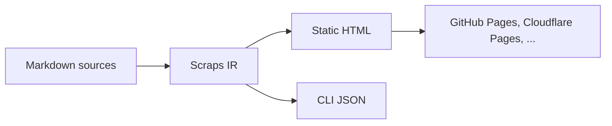

#[[Emit/Static Site]]

```mermaid
graph LR
  Source[Markdown sources] --> IR[Scraps IR]
  IR --> HTML[Static HTML]
  IR --> JSON[CLI JSON]
  HTML --> Pages[GitHub Pages, Cloudflare Pages, ...]
```

The HTML emitter takes the Scraps IR and produces a static directory tree,
which any Pages-class host can serve. See [[How-to/Deploy to GitHub Pages]]
for one such recipe.
