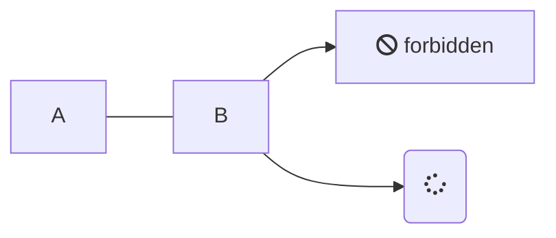

#[[Content]]

## CommonMark specification
Scraps supports Markdown syntax according to the CommonMark specification.

Please refer to the documentation of the pulldown-cmark library used internally for more details.

[CommonMark specification - pulldown-cmark guide](https://pulldown-cmark.github.io/pulldown-cmark/third_party/spec.html)

## GitHub-flavored Markdown
As an extension, GitHub-flavored Markdown is also supported. This includes features such as strikethrough, tables, and task lists.


### Strikethrough:

#### Markdown

`~~This text is strikethrough.~~`

#### Result

~~This text is strikethrough.~~

### Task Lists:

#### Markdown

```
- [x] Task 1
- [ ] Task 2
- [ ] Task 3
```

#### Result

- [x] Task 1
- [ ] Task 2
- [ ] Task 3

## Mermaid
By specifying `mermaid` as the language for a code block, you can use [Mermaid](https://mermaid.js.org/intro/) diagrams.

#### Markdown

<pre><code>

</code></pre>

#### Result


