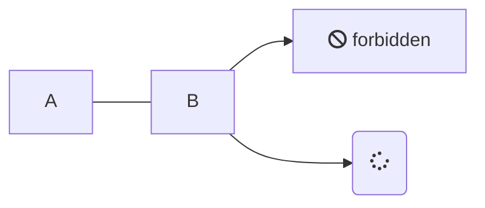

#[[Content]] #[[Markdown Syntax]]

By specifying `mermaid` as the language for a code block, you can use [Mermaid](https://mermaid.js.org/intro/) diagrams.

#### Markdown

<pre><code>

</code></pre>

#### Result

